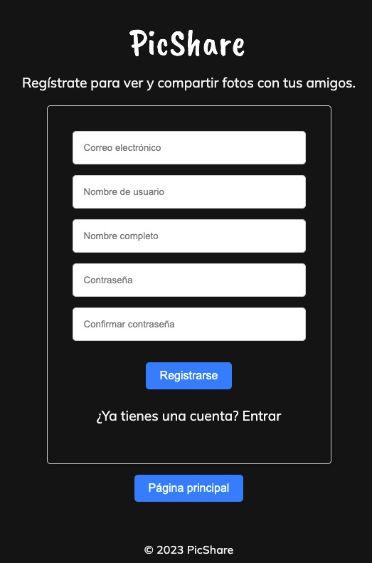
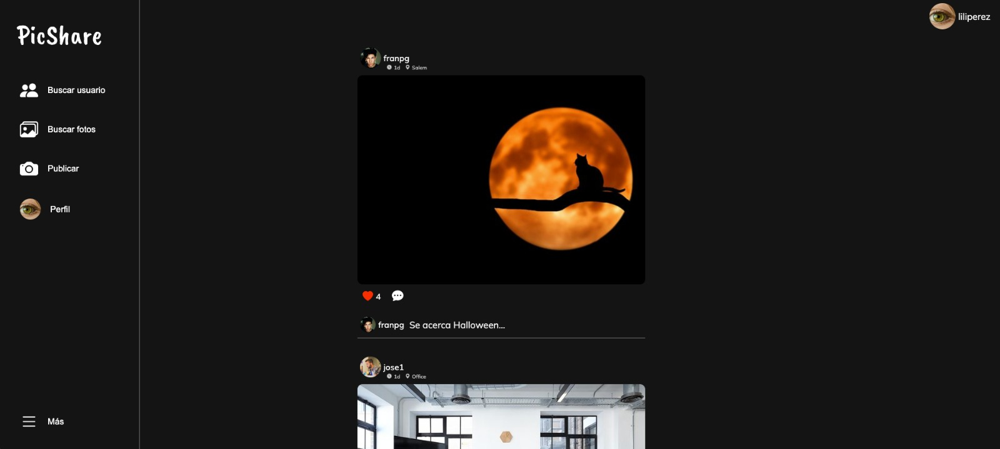
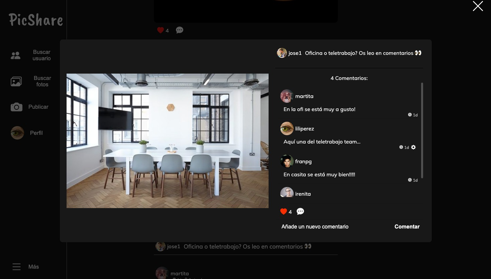
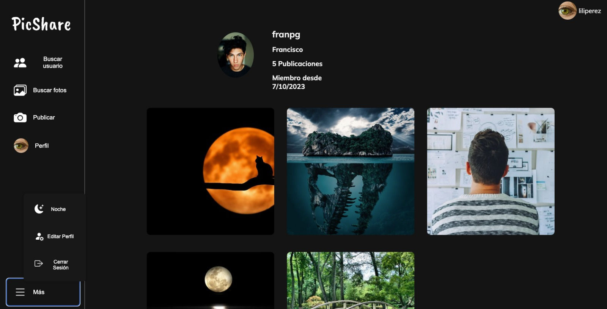

# PicShare Frontend


## Descripción
Este proyecto es la interfaz de usuario para la aplicación PicShare, que se conecta a la API de PicShare para permitir a los usuarios interactuar con la plataforma de compartir fotos. Permite a los usuarios registrados ver, publicar y comentar fotos, así como interactuar con otros miembros de la comunidad PicShare.


## Capturas de pantalla

A continuación se muestran algunas capturas de pantalla de la interfaz de usuario de PicShare Frontend:


*Inicio de sesión*


*Explorar fotos*


*Publicación*


*Perfil de usuario*


*Editar perfil de usuario*

## Características
### Usuarios Anónimos
- **Explorar Fotos:** Los usuarios pueden explorar fotos publicadas por otros miembros de la comunidad.
- **Ver Perfiles:** Pueden ver los perfiles de otros usuarios, incluyendo su galería de fotos y detalles de perfil.
- **Búsqueda por Texto**: Encuentra fotos buscando por palabras clave o descripciones.
- **Registro e Inicio de Sesión:** Los usuarios pueden registrarse e iniciar sesión para acceder a sus cuentas.
- **Login**: Inicia sesión para acceder a más funcionalidades.

### Usuarios Registrados
- **Gestión de Perfil**: Actualiza tu perfil y realiza cambios en tus datos de registro.
- **Publicar Fotos**: Sube tus fotos favoritas, que se ajustarán automáticamente a un tamaño máximo y proporciones establecidas por la plataforma. Añádeles una descripción para contar la historia detrás de cada imagen.
- **Likes**: Exprésate dando "likes" a las fotos que te gusten y retira tu "like" si cambias de opinión.
- **Comentarios**: Interactúa con otros usuarios dejando comentarios en sus fotos, también podrás editar o borrar los comentarios si lo necesitas.

## Instalación

1. Clona este repositorio en tu máquina local.

2. Instala las dependencias utilizando el gestor de paquetes `npm`.

```
npm i
```

## Variables de entorno

Para utilizar este proyecto, se necesitan las siguientes variables de entorno en el archivo .env

`VITE_APP_BACKEND` 


## Tech Stack

**Frontend:** React, Vite


## Autores

- [@dgr92](https://github.com/dgr92) - David Graciá
- [@godwitoski](https://github.com/godwitoski) - Juan Esteban De León
- [@liliperezglez](https://github.com/liliperezglez) - Liliana Pérez
- [@topher212](https://github.com/topher212) - Cristopher Herrán


## 🔗 Enlaces

[](https://www.linkedin.com/in/david-gr/) David Graciá 

[](https://www.linkedin.com/in/juanesteban-deleonrosario/) Juan Esteban De León

[](https://www.linkedin.com/in/liliana-perez-gonzalez//) Liliana Pérez

[](https://www.linkedin.com/in/cristopher-herr%C3%A1n-guerreiro/) Cristopher Herrán